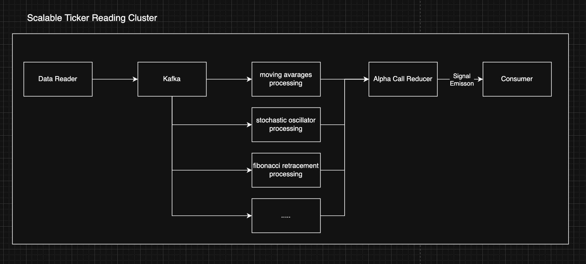

# Infinitely Scalable Market Research Orchestration POC




## Abstract

This repository contains a proof of concept for an orchestration structure that targets elastic, cost aware market research at scale. It demonstrates a modular data and compute pipeline that can ingest heterogeneous ticker streams, derive indicators, generate action calls, and publish signals to downstream consumers. The POC validates interfaces, reliability patterns, and scaling levers. It is not production ready. Do not use in production.

## Problem Statement

Research teams need consistent, traceable signals across fast moving markets. Ad hoc scripts do not scale, and monoliths resist change. The goal is a composable pipeline that isolates concerns, scales hot spots independently, and preserves lineage from raw tick to action call.

## Project Structure

```
FluxQueueAbstractPOC/
├── infrastructure/          # Dockerfiles for each service
│   ├── Dockerfile.postgres
│   ├── Dockerfile.telegram_bot
│   └── Dockerfile.notifier
├── apps/                    # Application code
│   ├── telegram_bot/        # Telegram bot service
│   ├── notifications/      # Notifications service
│   └── alembic/            # Database migrations
├── packages/                # Shared packages
├── docker-compose.dev.yml   # Development environment
├── docker-compose.prod.yml  # Production environment
└── ...
```

## Components

1. Data reading service
   Ingests tick and bar data from configured sources, for example equities and crypto. Supports pull via REST, websocket subscription, or batch files. Normalizes symbols, timestamps, and corporate actions. Emits validated records to Kafka.

2. Kafka
   Acts as the durable event backbone. Topics segment raw ticks, enriched features, and action calls. Partitioning by symbol provides horizontal throughput. Consumer groups allow multiple processors to read the same stream safely.

3. Indicator processor
   Computes technical indicators such as moving averages, RSI, Fibonacci retracements, and Stochastic Oscillators. Stateless workers consume from Kafka, read historical context from a feature store or local cache, and publish derived features back to Kafka with versioned metadata.

4. Alpha call reducer
   Transforms indicators into actionable calls using rule engines or lightweight models. Combines thresholds, ensemble voting, and optional ML scoring. Outputs Buy, Sell, Hold, or No Action with confidence and rationale fields.

5. Consumer
   Any third party or internal service that subscribes to action calls. Examples include alerting systems, dashboards, backtesting frameworks, and order simulators.

## Architecture and Operations

Kubernetes orchestrates services, with Helm or GitOps for repeatable deploys. Observability includes logs, metrics, and traces, plus dead letter topics for failure analysis. Schema management uses an IDL and a schema registry. Secrets are stored in a vault. CI validates contracts and replays sample traffic.

## Scalability

Scale by partition count, consumer group size, and stateless worker replicas. Storage and cache layers scale independently. Backpressure is handled through Kafka retention, consumer lag monitoring, and adaptive batch sizes.

## Governance and Risk

Each message carries schema version, source, and processing step. Access is role based. PII is not expected, but guardrails exist. This POC trades completeness for clarity and reliability for speed.

## Roadmap

Add richer feature store integration, more indicators, stronger model governance, and end to end backtesting with reproducible snapshots. Harden error handling, disaster recovery, and SLOs. Again, do not use this POC in production.

## Development Setup

> **Note:** The project now uses `docker-compose.dev.yml` and `docker-compose.prod.yml` for proper dev/prod separation. The old `dev-postgres-docker-compose.yml` and `prod-postgres-docker-compose.yml` files are deprecated but kept for backward compatibility.

### Prerequisites
- Docker and Docker Compose
- Python 3.13+ (for local development)

### Environment Configuration

1. **Development Environment:**
   ```bash
   cp env.dev.template .env.dev
   # Edit .env.dev with your development credentials
   ```

2. **Production Environment:**
   ```bash
   cp env.prod.template .env.prod
   # Edit .env.prod with your production credentials
   # IMPORTANT: Use strong passwords and secure tokens!
   ```

### Running the Application

#### Development Mode

Start all services in development mode (with hot-reload via volume mounts):
```bash
make dev-up
```

View logs:
```bash
make dev-logs
```

Stop services:
```bash
make dev-stop
# or
make dev-down  # stops and removes containers
```

#### Production Mode

Start all services in production mode:
```bash
make prod-up
```

View logs:
```bash
make prod-logs
```

Stop services:
```bash
make prod-stop
# or
make prod-down  # stops and removes containers
```

### Local Development (without Docker)

Install dependencies:
```bash
make install
```

Run migrations:
```bash
make migrate
```

Run services locally:
```bash
make run-tg      # Telegram bot
make run-notif   # Notifications service
```

### Available Make Commands

- `make install` - Install Python dependencies
- `make migrate` - Run database migrations
- `make make-migration` - Create a new migration
- `make dev-up` - Start development environment
- `make dev-down` - Stop and remove development containers
- `make dev-logs` - View development logs
- `make dev-stop` - Stop development containers
- `make dev-restart` - Restart development containers
- `make prod-up` - Start production environment
- `make prod-down` - Stop and remove production containers
- `make prod-logs` - View production logs
- `make prod-stop` - Stop production containers
- `make prod-restart` - Restart production containers

### Environment Differences

**Development:**
- Uses `postgres_data/` directory for database storage
- Source code is mounted as volumes for hot-reload
- Uses `.env.dev` for configuration
- Database exposed on port `5434` (all interfaces)

**Production:**
- Uses `postgres/prod/postgres_data/` directory for database storage
- No volume mounts (uses built Docker images)
- Uses `.env.prod` for configuration
- Database exposed on port `5434` (localhost only: `127.0.0.1:5434`)
- All services have `restart: always` policy
- Custom PostgreSQL image with migration support
